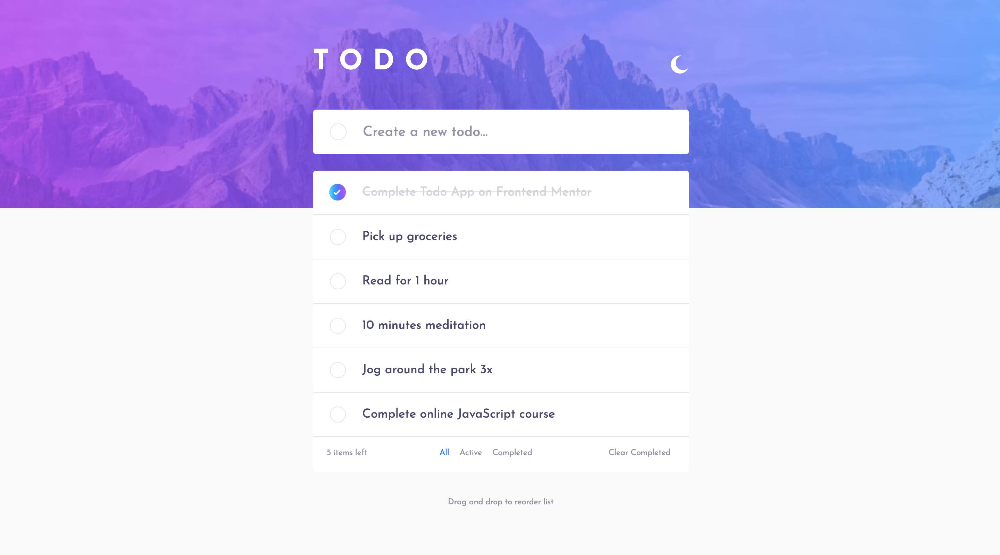
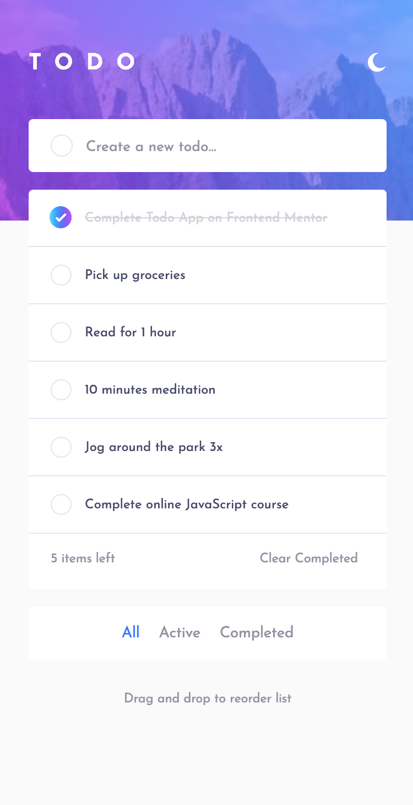

# Frontend Mentor - Todo app solution

This is a solution to the [Todo app challenge on Frontend Mentor](https://www.frontendmentor.io/challenges/todo-app-Su1_KokOW). Frontend Mentor challenges help you improve your coding skills by building realistic projects. 

## Table of contents

- [Overview](#overview)
  - [The challenge](#the-challenge)
  - [Screenshot](#screenshot)
  - [Links](#links)
- [My process](#my-process)
  - [Built with](#built-with)
  - [What I learned](#what-i-learned)
  - [Useful resources](#useful-resources)
- [Author](#author)


## Overview

### The challenge

Users should be able to:

- View the optimal layout for the app depending on their device's screen size
- See hover states for all interactive elements on the page
- Add new todos to the list
- Mark todos as complete
- Delete todos from the list
- Filter by all/active/complete todos
- Clear all completed todos
- Toggle light and dark mode
- **Bonus**: Drag and drop to reorder items on the list

### Screenshot




### Links

- Solution URL: [Solution](https://github.com/andyjv1/todo-app.git)
- Live Site URL: [Live](https://todo-app-xecu.onrender.com/)

## My process

### Built with

- Semantic HTML5 markup
- CSS custom properties
- Flexbox
- Mobile-first workflow
- Axios
- React


### What I learned

I learn how to do my first full stack project. So i learn how to use node and axios for this project.

```js

  const fetchTasks = async () => {
    try {
      const response = await axios.get("http://localhost:3500/tasks");
      setTasks(response.data);
      setError("")
    } catch (err) {
      console.log(err.response.data.message);
      setError(err.response.data.message)
      setTasks([]);
    }
  };
```

### Useful resources

- [MERN Recipe App with Authentication - Build & Deploy A React Intermediate Project](hhttps://www.youtube.com/watch?v=P43DW3HUUH8&t=9041sm) - Great video on how to use axios

## Author

- Frontend Mentor - [@andyjv1](https://www.frontendmentor.io/profile/andyjv1)
